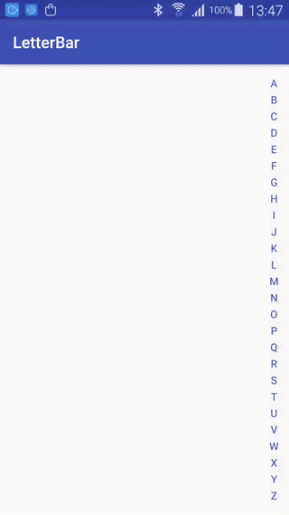

# LetterBar
一个用于Android的字母索引侧边条控件
# 快速使用

```
compile 'com.eric.android.view:letterbar:1.0.2'
```
# 属性设置

```
<!--设置默认字体颜色-->
android:textColor="@color/colorPrimary"
<!--设置默认字体大小-->
android:textSize="13sp"
<!--设置触摸后的高亮背景色-->
app:highlightBackground="#10000000"
<!--设置触摸后的高亮字体颜色-->
app:highlightColor="@color/colorAccent"
```

# 代码示例

```
public class MainActivity extends AppCompatActivity {
    private LetterBar letter_bar;
    private TextView tv_letter;

    @Override
    protected void onCreate(Bundle savedInstanceState) {
        super.onCreate(savedInstanceState);
        setContentView(R.layout.activity_main);
        tv_letter = findViewById(R.id.tv_letter);
        letter_bar = findViewById(R.id.letter_bar);
        //触摸后的监听回调
        letter_bar.setOnLetterChangeListener(new LetterBar.OnLetterChangeListner() {
            @Override
            public void onLetterChanged(String letter) {
                tv_letter.setVisibility(View.VISIBLE);
                tv_letter.setAlpha(1);
                tv_letter.setText(letter);
            }

            @Override
            public void onLetterChoosed(String letter) {
                tv_letter.animate().alpha(0).setDuration(500).setListener(new AnimatorListenerAdapter() {
                    @Override
                    public void onAnimationEnd(Animator animation) {
                        super.onAnimationEnd(animation);
                        tv_letter.setVisibility(View.GONE);
                    }
                });
            }
        });
    }
}
```

# 效果图


